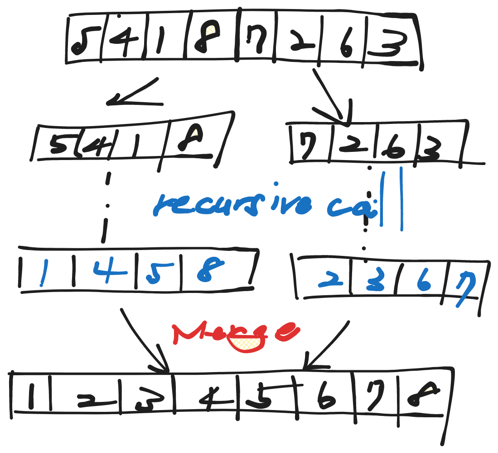
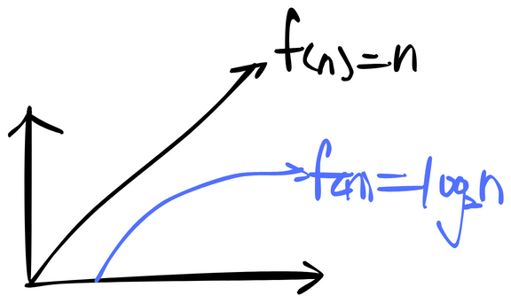
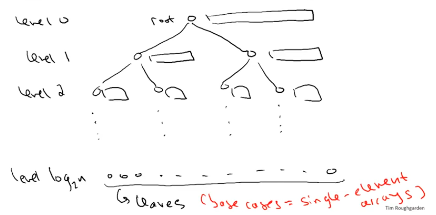

---
tags:
  - algorithms illuminated
---

# Merge Sort

# Why study merge sort?

- Good introduction to divide & conquer

  - improves over selection, insertion, bubble sorts

- Calibrate your preparation

- Motivates guiding principles for algorithm analysis (worst-case and asymptotic analysis)

- Analysis generalizes to “Master Method“

## Example



## Merge Sort: Pseudocode

- recursively sort 1st half of input array

- recursively sort 2nd half of input array

- merge two sorted sublists into one

### Pseudocode for Merge

```ts
/**
  C = output array (length = n)
  A = 1st sorted array (n / 2)
  B = 2nd sorted array (n / 2)
  i = 1
  j = 1

  for k = 1 to n
    if A(i) < B(j)
      C(k) = A(i)
      i++
    else 
      C(k) = B(j)
      j++
  end
  (ignores end cases)
*/
```

## Merge Sort Running Time?

- Running Time of Merge

  - Upshot: running time of Merge on array of m numbers is $≤ 4m + 2$ (6m since m ≥ 1)



### Claim

For every input array of n numbers, Merge Sort produces a sorted output array and uses at most $6nlog_2n + 6n$ operations.

**Proof of claim (assuming n = power of 2)**

- will use '“recursion tree“



- The total number of levels is $log_2n + 1$

- At the level j, there are $2 ^ j$ subproblems and each of size $\frac{n}{2 ^ j}$

- $≤ 2 ^ j \times \frac{n}{2 ^ j} = 6n$ (independent of j)

- Total $≤ 6n (log_2n + 1)$
